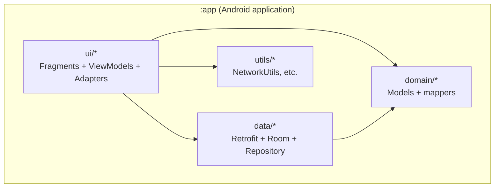
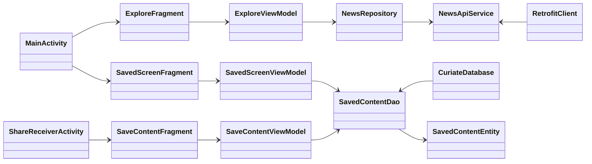
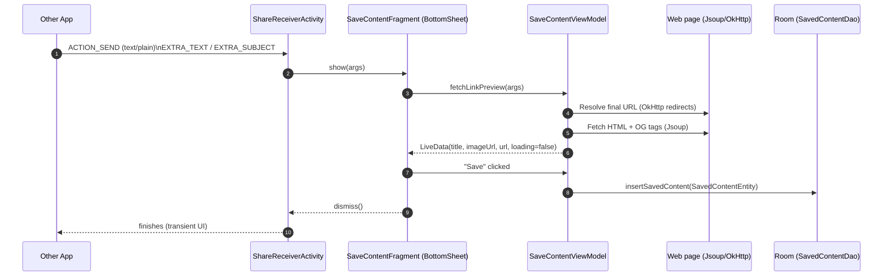
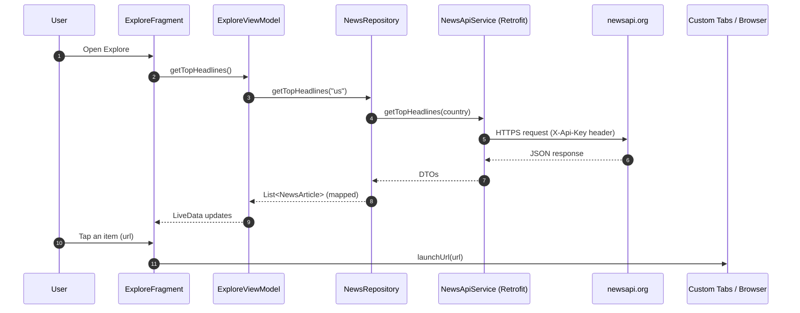
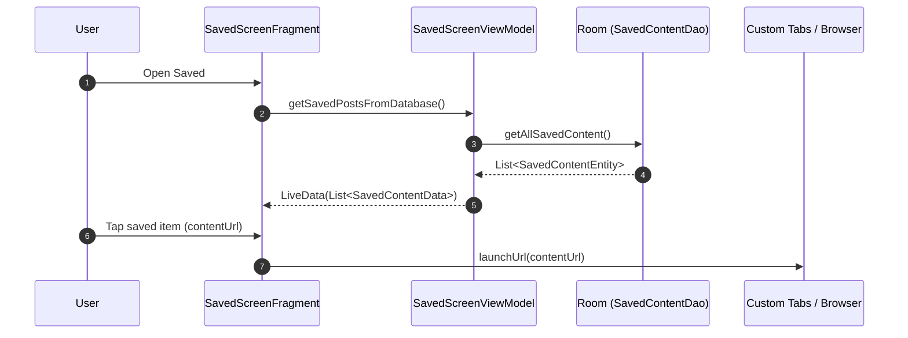
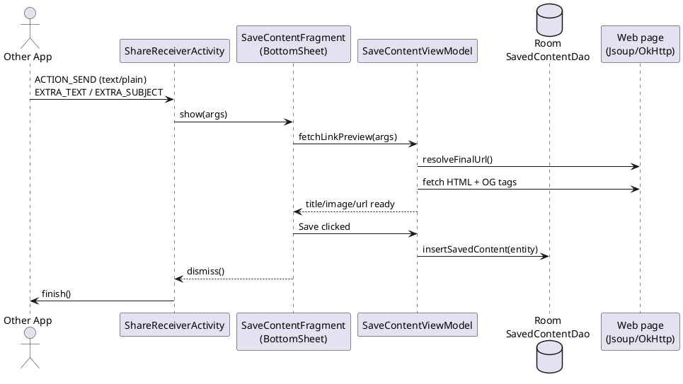

# Curiate — Project Documentation

## Overview

**Curiate** is an Android app for **curating web content**:

- **Save from anywhere**: It registers as a share target for `text/plain`, so you can share a link from any app into Curiate.
- **Explore + search**: It provides an **Explore** screen powered by NewsAPI (`newsapi.org`) to discover and search articles.
- **Rich previews + offline access**: When saving a link, it fetches OpenGraph metadata (title/image/url) and stores it locally in a Room database so your saved items are available offline.

### Why this project is useful

- **Personal knowledge management (PKM)** on mobile: quickly capture and organize reading material without leaving the source app.
- **Offline-first reading list**: saved items are backed by a local database.
- **Reference Clean Architecture (single-module)**: this codebase is a compact example of UI/Domain/Data separation using MVVM, Repository, Retrofit, Room, Coroutines, and Jsoup.

## Quick start (dev)

### Prerequisites

- Android Studio (or IntelliJ) with Android + Kotlin support
- JDK 11+

### Configure NewsAPI key

The app injects a `BuildConfig.NEWS_API_KEY` from `local.properties`.

1. Create/update `local.properties` at the repo root:

```properties
NEWS_API_KEY=YOUR_KEY_HERE
```

2. Sync Gradle and run the `app` configuration.

## Project structure

This is a **single Gradle module** project:

- `:app`: Android application module (`com.curiate.android`)

Key package layout inside `app/src/main/java/com/curiate/android/`:

- `ui/`: Screens/fragments, adapters, viewmodels (MVVM)
  - `explorescreen/`: explore + search (NewsAPI)
  - `savedscreen/`: saved list (Room)
  - `savecontentbottomsheet/`: share-to-save bottom sheet (Jsoup metadata fetch)
  - `collectionscreen/`: placeholder screen (currently minimal)
- `domain/`: app models and mapping helpers
- `data/`: network + persistence + repository
  - `network/`: Retrofit client + DTOs
  - `database/`: Room DB + DAO + entity
  - `repository/`: repository wrapper around the network API
- `utils/`: cross-cutting helpers (e.g. network availability check)

## Architecture

### High-level approach

The README describes **Clean Architecture** with **MVVM**. In this codebase, the layers map roughly like this:

- **UI layer** (`ui/*`)
  - Fragments render views, set up adapters, and observe `LiveData`.
  - ViewModels execute asynchronous work via `viewModelScope` and expose screen state.
- **Domain layer** (`domain/*`)
  - Plain Kotlin models used by the UI.
  - Mapping functions from network DTOs → domain models.
- **Data layer** (`data/*`)
  - Retrofit for remote content (NewsAPI).
  - Room for local persistence of saved links.

### Module diagram (single module)



### Component-level diagram (key collaborators)



### App entry points and navigation

- **Launcher entry**: `MainActivity`
  - Hosts a `BottomNavigationView` and swaps fragments into `R.id.fragment_container`.
  - Screens:
    - **Saved**: `SavedScreenFragment`
    - **Explore**: `ExploreFragment`
    - **Collection**: `CollectionFragment` (currently a stub/placeholder fragment)

- **Share entry**: `ShareReceiverActivity`
  - Declared with an `ACTION_SEND` intent filter for `text/plain`.
  - Immediately shows `SaveContentFragment` as a bottom sheet.
  - Finishes itself when the bottom sheet is dismissed (so it behaves like a transient “Save to Curiate” UI).

### Data flow diagrams

#### Flow 1 — Share a link from another app → save to offline library



#### Flow 2 — Explore/search → open article in Custom Tabs



#### Flow 3 — Saved screen → load from Room → open article



### Network & persistence details

#### Remote content (NewsAPI)

- **Client**: Retrofit + Gson
- **Auth**: An OkHttp interceptor injects `X-Api-Key: BuildConfig.NEWS_API_KEY`
- **Endpoints**:
  - `GET /v2/top-headlines?country=...`
  - `GET /v2/everything?q=...`

#### Local storage (Room)

- **Database**: `CuriateDatabase` (`curiate_database`), destructive migrations enabled (`fallbackToDestructiveMigration`)
- **Entity**: `SavedContentEntity`
  - `contentUrl`, `imageUrl`, `title`, `category`
- **DAO**:
  - `getAllSavedContent()` (ordered desc by id)
  - `insertSavedContent()` (replace on conflict)
  - `deleteSavedContent()`

#### Link preview parsing (Jsoup + OpenGraph)

When saving a shared link:

- Extract first URL from `Intent.EXTRA_TEXT` via `Patterns.WEB_URL`
- Resolve redirects (except YouTube shortcut) using OkHttp
- Fetch HTML using Jsoup and parse:
  - `og:title` (fallback to `doc.title()`, fallback to subject/text-derived title)
  - `og:image` (normalized to https if needed)
  - `og:url` (fallback to resolved URL)
- Infer a lightweight **category** from the URL host (e.g., `nytimes.com` → `nytimes`)

## Current limitations / notable design trade-offs

- **Dependency injection** is manual (ViewModel factories + direct construction in Fragments) rather than using Hilt/Koin.
- **Repository** currently wraps only the remote NewsAPI calls; Room access for saved items is done directly via DAO in ViewModels.
- **Error handling** is simple (string messages, generic exceptions); retries/backoff and richer error states are not implemented.
- **Room migrations** are destructive; upgrading schema wipes saved data.
- **Collection screen** exists in navigation but is currently a placeholder.

## Future scope

### Product/features

- **Collections & tagging**
  - Let users create collections (folders) and assign saved items
  - Add user-defined tags, pinning, favorites, and sorting options
- **Better offline reading**
  - Cache full article text (where allowed) using Readability-style parsing
  - Provide a dedicated reader mode with typography controls
- **Search across saved items**
  - Full-text search (FTS) in Room (FTS4/FTS5) for titles/content
- **Share enhancements**
  - Support sharing multiple links at once
  - Add a quick “Save silently” mode + undo
- **Content enrichment**
  - Extract author/site/favicon/reading time
  - Detect duplicates (same canonical URL) and merge

### Engineering/architecture

- **Introduce DI** (Hilt recommended)
  - Provide Retrofit, Room, repositories, and dispatchers via modules
  - Remove manual wiring from Fragments
- **Unify data access behind repositories**
  - Create a `SavedContentRepository` that abstracts Room operations
  - Make ViewModels depend on interfaces (improves testability)
- **Kotlin Flow + State management**
  - Replace or complement `LiveData` with `StateFlow`/`SharedFlow`
  - Model UI state as a sealed `UiState` (Loading/Success/Empty/Error)
- **Non-destructive migrations**
  - Add proper Room migrations to preserve user data
- **Testing**
  - Unit tests for mappers + repositories
  - Instrumentation tests for Room DAO and basic UI flows
- **Modularization (optional)**
  - Split into `:core`, `:data`, `:domain`, `:feature-*` modules if the app grows

## Appendix: PlantUML (optional)

If your documentation tooling supports PlantUML, here’s a sequence diagram for the share-to-save flow:


